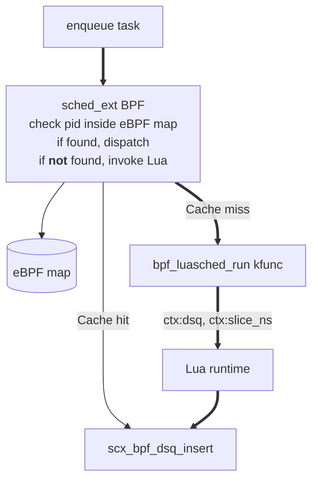

> Write a program which schedules other programs.

Linux scheduling policy is usually buried deep inside the kernel. Even with
[sched_ext](https://github.com/sched-ext/scx), the policy is typically implemented as an eBPF program compiled
ahead of time.

I contributed to [Lunatik](https://github.com/luainkernel/lunatik) as part of
GSoC project in
[2026](https://summerofcode.withgoogle.com/programs/2026/projects/IHF0HPaF).

[luasched](https://github.com/luainkernel/lunatik/pull/572) is a part of that project.

It is a Lunatik binding created with a different approach: the
scheduler remains in eBPF, but task classification is delegated to a Lua
script. Instead of rebuilding the scheduler whenever policy changes, we can simply edit a Lua file.

## Motivation

Suppose we want:
- Nginx workers to get low latency scheduling
- Firefox background processes to receive larger time slices
- Everything else to use the default policy

Traditionally this logic would be hardcoded inside the scheduler like so:
```c
if (is_nginx(task))
    ...
else if (is_firefox(task))
    ...
```

There are two pain points:
- Every change is in eBPF, and the eBPF code is a pain to write.
- Every policy change requires recompilation.

With luasched, the scheduler asks Lua how a task should be treated.
```lua
if task:comm():match("^nginx") then
	ctx:dsq(REALTIME)
	ctx:slice_ns(10000000)
end
```

> [!IMPORTANT] 
> The scheduling mechanism stays in eBPF.
> The scheduling policy lives in Lua.

Architecture:



There are two parts to this scheduler:
- Create an eBPF scheduler which handles the fast path.
- Create a `workload.lua` policy handler which takes care of slow path.
- The first time a task is seen, the scheduler invokes Lua.
- Lua returns:
    - target dispatch queue (DSQ)
    - scheduling slice
- The result is cached in a BPF hash map keyed by PID.
- Subsequent enqueues avoid Lua entirely.

## Dispatch Queues

The user needs to define (on eBPF side) dispatch queues, like so.
```c
#define DSQ_REALTIME 0
#define DSQ_BATCH    1
#define DSQ_DEFAULT  2
```

During initialization (on eBPF side) these queues are created:
```c
scx_bpf_create_dsq(DSQ_REALTIME, -1);
scx_bpf_create_dsq(DSQ_BATCH, -1);
scx_bpf_create_dsq(DSQ_DEFAULT, -1);
```

Tasks are inserted into one of these queues based on their Lua-assigned class.

The dispatcher prioritizes them in order:


This means latency-sensitive work can be serviced before background workloads.

## eBPF scheduler

Now on eBPF side create a map for caching pids with enqueue decisions. Define an enqueue
decision as the following struct:
```c
struct task_class {
	s32 dsq;
	u64 slice_ns;
};
```

Now we create the map for caching the decisions
```c
struct {
	__uint(type, BPF_MAP_TYPE_HASH);
	__uint(max_entries, 10240);
	__type(key, pid_t);
	__type(value, struct task_class);
} task_classes SEC(".maps");
```

The interesting part happens inside enqueue.
If the task was previously classified, the cached result is reused.
```c
void BPF_STRUCT_OPS(luasched_enqueue, struct task_struct *p, u64 enq_flags)
{
    pid_t pid = p->pid;
    struct task_class *cls;
    
    cls = bpf_map_lookup_elem(&task_classes, &pid);
    if (cls) {
    	scx_bpf_dsq_insert(p, cls->dsq, cls->slice_ns, 0);
    	return;
    }
    ...
    /* invoke Lua to determine the enqueue verdict */
}
```

If no cached result is found, Lua is invoked.
The function is exposed as a kfunc
```c
extern int bpf_luasched_run(
    const char *key, 
    size_t key__sz, 
    struct task_struct *task, 
    struct task_class *cls
) __ksym;
```

It recieves a pointer to `struct task_class` and modifies it according to a Lua policy
```c
void BPF_STRUCT_OPS(luasched_enqueue, struct task_struct *p, u64 enq_flags)
{
    ...
    /* invoke Lua to determine the enqueue verdict */
    struct task_class received_cls = { .dsq = -1, .slice_ns = -1 };
    
    int ret = bpf_luasched_run(runtime, sizeof(runtime), p, &received_cls);
    
    bpf_map_update_elem(&task_classes, &pid, &received_cls, BPF_ANY);
    scx_bpf_dsq_insert(p, received_cls.dsq, received_cls.slice_ns, 0);
}
```

## Writing Policy in Lua

The scheduler itself knows nothing about process names like nginx or firefox.

That knowledge lives entirely in Lua.
```lua
local policy = {
    { pattern = "^nginx", dsq = REALTIME, slice = 1000000 },
    { pattern = "^firefox", dsq = BATCH, slice = 10000000 },
}
```

On Lua we attach a handler to set the enqueue verdict
```lua
local sched = require("sched")

local function workload(ctx)
	local task = ctx:task()
	for _, rule in ipairs(policy) do
		if task:comm():match(rule.pattern) then
			ctx:dsq(rule.dsq)
			ctx:slice_ns(rule.slice)
			return
		end
	end
	ctx:dsq(DEFAULT)
	ctx:slice_ns(scx.SLICE_DFL)
end

sched.attach(workload)
```


## Why Cache Results?

Calling into Lua on every enqueue would be expensive.
A task's command name rarely changes after startup.
By classifying a task once and storing the result in a BPF map, the scheduler
pays the Lua cost only once.

All future scheduling decisions become simple hash lookups.

