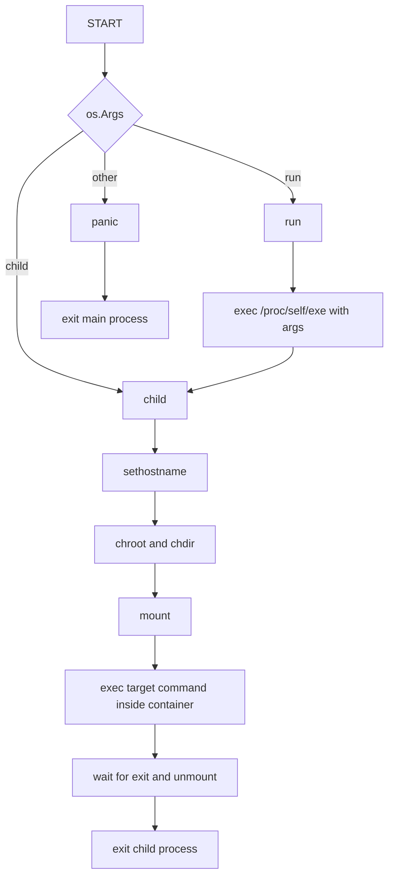

## Containerization
> Deep inside user space and linux process management

But how is Docker is even implemented? What means to spawn a container?

## Go: minimal container
Create the following program in a new folder

```go title="container.go"
package main

import (
	"fmt"
	"os"
	"os/exec"
	"syscall"
)

const ROOT_DIR = "./fs"

func run() {
	fmt.Printf("running %v as %d\n", os.Args[2:], os.Getpid())
	cmd := exec.Command("/proc/self/exe", append([]string{"child"}, os.Args[2:]...)...)
	cmd.Stdin = os.Stdin
	cmd.Stdout = os.Stdout
	cmd.Stderr = os.Stderr

	cmd.SysProcAttr = &syscall.SysProcAttr{
		Cloneflags: syscall.CLONE_NEWUTS | syscall.CLONE_NEWPID,
	}

	cmd.Run()
}

func child() {
	fmt.Printf("running %v as %d\n", os.Args[2:], os.Getpid())
    syscall.Sethostname([]byte("container"))

    // Change root to fs directory
	must(syscall.Chroot(ROOT_DIR))
	must(syscall.Chdir("/"))

    // Mount /proc to see PID namespace info
	must(syscall.Mount("proc", "/proc", "proc", 0, ""))

	cmd := exec.Command(os.Args[2], os.Args[3:]...)
	cmd.Stdin = os.Stdin
	cmd.Stdout = os.Stdout
	cmd.Stderr = os.Stderr
    cmd.Env = append(os.Environ(), "PATH=/bin")

	must(cmd.Run())

    // Unmount the proc directory after container shuts down
    must(syscall.Unmount("/proc", 0))
}

func must(err error) {
    if err != nil { panic(err) }
}

func main() {
	switch os.Args[1] {
	case "run":
		run()
	case "child":
		child()
	default:
		panic("bad command")
	}
}
```

## How does this work
Consider the following flowchart, it is the explanation for the code snippet given directly above




## Minimal filesystem
We will spawn a container rooted inside the `./fs` directory, for this we need to setup `fs`. Create the following script outside `fs`
```bash title="make-rootfs.sh"
#!/bin/bash

# 1. Make sure the fs tree exists
mkdir -p fs/{bin,proc}

# 2. Download a real binary
if [ ! -f ./fs/bin/busybox ]; then
    curl -L https://busybox.net/downloads/binaries/1.35.0-x86_64-linux-musl/busybox -o fs/bin/busybox
fi

# (Check BusyBox site for the latest x86_64 build if the above link 404s)
# 3. Make it executable and symlink sh
chmod +x fs/bin/busybox
for app in sh ls cat echo ps; do
    if [ ! -f ./fs/bin/$app ]; then
        ln -s busybox fs/bin/$app
    fi
done
```

## Spin up container
This will spawn a child process which execs the program given by the user (we will try to invoke `./fs/bin/sh`).
- run the script defined above: `sudo ./make-rootfs.sh`
- build the container binary: `go build -o container container.go`
- run the container: `sudo ./container run /bin/sh`

```shell
$ sudo ./container run /bin/sh
running [/bin/sh] as 1079
running [/bin/sh] as 1
/ # ls -a
.     ..    bin   proc
/ # ps
PID   USER     TIME  COMMAND
    1 0         0:00 /proc/self/exe child /bin/sh
    7 0         0:00 /bin/sh
    9 0         0:00 ps
/ # exit
```
