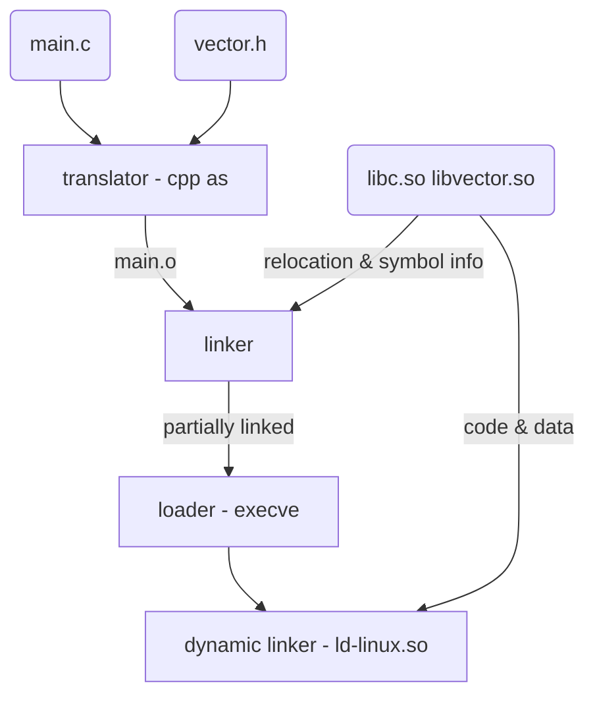

# Shared Libraries

> [!WARNING]
> Long read, but worth it if one wants to understand shared libraries and their dynamics

If an ELF has a program header of the type `INTERP` then that means it will load a dynamically linked library somewhere
Program Headers

| Type   | Offset   | Virtual Address | Physical Address | File Size | Memory Size | Flags | Alignment |
| ------ | -------- | --------------  | ---------------- | --------- | ----------- | ----- | --------- |
| PHDR   | 0x000040 | ...             | ...              | ...       | ...         | R     | 0x8       |
| INTERP | 0x000318 | ...             | ...              | ...       | ...         | R     | 0x1       |

[Requesting program interpreter: /lib64/ld-linux-x86-64.so.2]

> [!NOTE]
> The above output is from the command `readelf -l /bin/ls`

## Linker
In normal case, this is what the linker does:

- Symbol resolution: finding definitions for each symbol
- Relocation: merging files and updating address for all references

In case of dynamically linked libraries, this is what happens

1. Linking
    - Create an executable that can be linked with the library at **load time**
    - Copy relocation and symbol table information from library
    - Create `.interp` section with the location of dynamic linker
2. Loading
    - Check for `.interp` section
    - Run the dynamic linker
    - Dynamic linker: relocates the text and data section of the shared libraries in memory
    - Dynamic linker: relocates references to any symbols referenced in shared library



## Global Offset Table

Solution for variables during link time

- create a GOT at the beginning of data section
- linker generates a relocation entry for each variable in the GOT
- update references to now point to PC-relative GOT entry

## PIC Function Calls

- Lazy binding: bind each procedure address the first time the procedure is actually called
> The motivation for lazy binding is that a typical application program will call only a handful of the hundreds or thousands of functions exported by a shared library such as libc.so. By deferring the resolution of a function’s address until it is actually called, the dynamic linker can avoid hundreds or thousands of unnecessary relocations at load time.

## Procedure Linkage Table

- contains code  to help with runtime linkage
- PLT[0] = points to dynamic linker of this library
- PLT[1] = system startup
- PLT[2] onwards = functions called by user

# Experiment: 2 function calls

1. Create a minimal C program with 2 printfs

```c title="minimal.c"
#include <stdio.h>

int main() {
    printf("hello world\n");
    printf("hello world again\n");
    return 0;
} 
```

1. Compile it dynamically but disable PIE and check address of PLT

```bash
$ gcc -fno-pie -no-pie -g -o minimal ./minimal.c
$ readelf -SW minimal
There are 36 section headers, starting at offset 0x38a0:

Section Headers:
  [Nr] Name              Type            Address          Off    Size   ES Flg Lk Inf Al
  [ 0]                   NULL            0000000000000000 000000 000000 00      0   0  0
  [ 1] .interp           PROGBITS        0000000000400318 000318 00001c 00   A  0   0  1
  [ 2] .note.gnu.property NOTE            0000000000400338 000338 000020 00   A  0   0  8
  [ 3] .note.gnu.build-id NOTE            0000000000400358 000358 000024 00   A  0   0  4
  [ 4] .note.ABI-tag     NOTE            000000000040037c 00037c 000020 00   A  0   0  4
  [ 5] .gnu.hash         GNU_HASH        00000000004003a0 0003a0 00001c 00   A  6   0  8
  [ 6] .dynsym           DYNSYM          00000000004003c0 0003c0 000060 18   A  7   1  8
  [ 7] .dynstr           STRTAB          0000000000400420 000420 000048 00   A  0   0  1
  [ 8] .gnu.version      VERSYM          0000000000400468 000468 000008 02   A  6   0  2
  [ 9] .gnu.version_r    VERNEED         0000000000400470 000470 000030 00   A  7   1  8
  [10] .rela.dyn         RELA            00000000004004a0 0004a0 000030 18   A  6   0  8
  [11] .rela.plt         RELA            00000000004004d0 0004d0 000018 18  AI  6  23  8
  [12] .init             PROGBITS        0000000000401000 001000 000017 00  AX  0   0  4
  [13] .plt              PROGBITS        0000000000401020 001020 000020 10  AX  0   0 16
  [14] .text             PROGBITS        0000000000401040 001040 000105 00  AX  0   0 16
  [15] .fini             PROGBITS        0000000000401148 001148 000009 00  AX  0   0  4
  [16] .rodata           PROGBITS        0000000000402000 002000 000022 00   A  0   0  4
  [17] .eh_frame_hdr     PROGBITS        0000000000402024 002024 00002c 00   A  0   0  4
  [18] .eh_frame         PROGBITS        0000000000402050 002050 0000a4 00   A  0   0  8
  [19] .init_array       INIT_ARRAY      0000000000403df8 002df8 000008 08  WA  0   0  8
  [20] .fini_array       FINI_ARRAY      0000000000403e00 002e00 000008 08  WA  0   0  8
  [21] .dynamic          DYNAMIC         0000000000403e08 002e08 0001d0 10  WA  7   0  8
  [22] .got              PROGBITS        0000000000403fd8 002fd8 000010 08  WA  0   0  8
  [23] .got.plt          PROGBITS        0000000000403fe8 002fe8 000020 08  WA  0   0  8
  [24] .data             PROGBITS        0000000000404008 003008 000010 00  WA  0   0  8
  [25] .bss              NOBITS          0000000000404018 003018 000008 00  WA  0   0  1
  [26] .comment          PROGBITS        0000000000000000 003018 000027 01  MS  0   0  1
  [27] .debug_aranges    PROGBITS        0000000000000000 00303f 000030 00      0   0  1
  [28] .debug_info       PROGBITS        0000000000000000 00306f 00008c 00      0   0  1
  [29] .debug_abbrev     PROGBITS        0000000000000000 0030fb 000043 00      0   0  1
  [30] .debug_line       PROGBITS        0000000000000000 00313e 000057 00      0   0  1
  [31] .debug_str        PROGBITS        0000000000000000 003195 0000a0 01  MS  0   0  1
  [32] .debug_line_str   PROGBITS        0000000000000000 003235 000027 01  MS  0   0  1
  [33] .symtab           SYMTAB          0000000000000000 003260 000330 18     34  18  8
  [34] .strtab           STRTAB          0000000000000000 003590 0001a3 00      0   0  1
  [35] .shstrtab         STRTAB          0000000000000000 003733 000166 00      0   0  1
Key to Flags:
  W (write), A (alloc), X (execute), M (merge), S (strings), I (info),
  L (link order), O (extra OS processing required), G (group), T (TLS),
  C (compressed), x (unknown), o (OS specific), E (exclude),
  D (mbind), l (large), p (processor specific)
```

2. Track the important addresses (`.plt` and `.got`), in our case PLT starts at 0x401020 and GOT at 0x403fd8

```bash
$ readelf -SW minimal | grep .plt
  [11] .rela.plt         RELA            00000000004004d0 0004d0 000018 18  AI  6  23  8
  [13] .plt              PROGBITS        0000000000401020 001020 000020 10  AX  0   0 16
  [23] .got.plt          PROGBITS        0000000000403fe8 002fe8 000020 08  WA  0   0  8
$ readelf -SW minimal | grep .got
  [22] .got              PROGBITS        0000000000403fd8 002fd8 000010 08  WA  0   0  8
  [23] .got.plt          PROGBITS        0000000000403fe8 002fe8 000020 08  WA  0   0  8
```

3. Spin up gdb and set breakpoints at line 4 and 5 and run the program (let it hit at first breakpoint - line 4)

```bash
Reading symbols from minimal...
(gdb) break minimal.c:4
Breakpoint 1 at 0x40112a: file ./minimal.c, line 4.
(gdb) break minimal.c:5
Breakpoint 2 at 0x401134: file ./minimal.c, line 5.
(gdb) r
Starting program: /home/shawn/junkyard/elf/minimal
[Thread debugging using libthread_db enabled]
Using host libthread_db library "/lib/x86_64-linux-gnu/libthread_db.so.1".

Breakpoint 1, main () at ./minimal.c:4
4           printf("hello world\n");
End of assembler dump.
(gdb)
```

4. Check the assembly for main

```bash
(gdb) disas main
Dump of assembler code for function main:
   0x0000000000401126 <+0>:     push   %rbp
   0x0000000000401127 <+1>:     mov    %rsp,%rbp
=> 0x000000000040112a <+4>:     mov    $0x402004,%edi
   0x000000000040112f <+9>:     call   0x401030 <puts@plt>
   0x0000000000401134 <+14>:    mov    $0x402010,%edi
   0x0000000000401139 <+19>:    call   0x401030 <puts@plt>
   0x000000000040113e <+24>:    mov    $0x0,%eax
   0x0000000000401143 <+29>:    pop    %rbp
   0x0000000000401144 <+30>:    ret
End of assembler dump.
(gdb)
```

5. Notice the address for printf: `0x402004` `<puts@plt>`, lets look at what this instruction does

```bash
(gdb) disas 'puts@plt'
Dump of assembler code for function puts@plt:
   0x0000000000401030 <+0>:     jmp    *0x2fca(%rip)        # 0x404000 <puts@got.plt>
   0x0000000000401036 <+6>:     push   $0x0
   0x000000000040103b <+11>:    jmp    0x401020
End of assembler dump.
(gdb)
```

6. Notice it jumps to `0x404000` , pushes 0 on the stack and then jumps again to some other address (which happens to be the address of `.plt` so it jumps back to beginning of plt)
7. The address `0x404000` lies somewhere in the `.got.plt` section, one can verify from the readelf output
8. Let us try to print what is pointed to at this address (this is a pointer to a pointer)

```bash
(gdb) p/x *(void**)0x404000
$1 = 0x401036
```

9. That is the next entry in the PLT
10. Let me put up a diagram for you to understand what is happening here

### What is going on?

```mermaid
flowchart TD
    A[puts@plt] --> B[0x401030: jmp 0x404000
    this is an address in GOT
    value: 0x401036]
    B -- jmp 0x401036 --> C[0x401036: push 0x0
    this is second enry in PLT]
    C --> D[0x40103b: jmp 0x401020
    this is the start of plt
    contains address to ld.so]
    D -- jmp 0x40103b --> E[ld.so
    this shall now invoke puts]
```

### Why extra jump just to call ld.so?

This will become clear only after we repeat the experiment but this time for line 5 (second call to printf)

11. Continue in gdb

```bash
(gdb) c
Continuing.
hello world

Breakpoint 2, main () at ./minimal.c:5
5           printf("hello world again\n");
(gdb)
```

12. Disassemble puts

```bash
(gdb) disas 'puts@plt'
Dump of assembler code for function puts@plt:
   0x0000000000401030 <+0>:     jmp    *0x2fca(%rip)        # 0x404000 <puts@got.plt>
   0x0000000000401036 <+6>:     push   $0x0
   0x000000000040103b <+11>:    jmp    0x401020
End of assembler dump.
(gdb)
```

13. Still same code, let us attempt to find what is pointed by the PLT entry this time

```bash
(gdb) p/x *(void**)0x404000
$2 = 0x7ffff7e4e980
```

14. This address is very far from everything we’ve seen till now. It is in fact the address to implmentation of printf. Time to look at exactly what happens here

```bash
(gdb) disas (void**)0x7ffff7e4e980
Dump of assembler code for function puts:
   0x00007ffff7e4e980 <+0>:     push   %r14
   0x00007ffff7e4e982 <+2>:     push   %r13
   0x00007ffff7e4e984 <+4>:     push   %r12
   0x00007ffff7e4e986 <+6>:     mov    %rdi,%r12
   0x00007ffff7e4e989 <+9>:     push   %rbp
   0x00007ffff7e4e98a <+10>:    push   %rbx
   0x00007ffff7e4e98b <+11>:    sub    $0x10,%rsp
   0x00007ffff7e4e98f <+15>:    call   0x7ffff7dfd110 <*ABS*+0x9f1b0@plt>
   0x00007ffff7e4e994 <+20>:    mov    0x15b46d(%rip),%r13        # 0x7ffff7fa9e08
   0x00007ffff7e4e99b <+27>:    mov    %rax,%rbx
```

15. That is the implementation of printf

### What is going on?

```mermaid
flowchart TD
    A[puts@plt] --> B[0x401030: jmp 0x404000
    this is an address of printf
    value: 0x7ffff7e4e980]
    B -- jmp 0x7ffff7e4e980 --> C[actual printf
    populated by ld.so while invoking it first time]
  
   
```

And that was an attempt to understanding lazy binding

## Making common case fast

This design exists so that we don’t have to link all the functions at the start and only link when the first procedure is required
