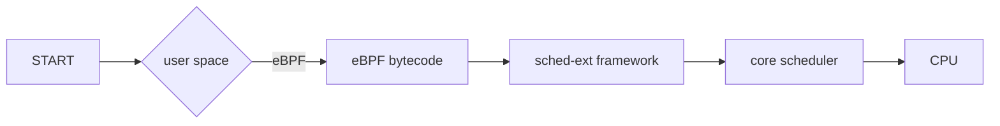

# External Scheduler

We can do rapid prototyping and try out different scheduling algorithms via eBPF and kernel hooks provided by [sched-ext](https://github.com/sched-ext/scx/)

## eBPF

High-level architecture:

## Hooks

Instead of CFS picking tasks via `pick_next_task_fair()`, sched-ext allows:
`pick_next_task_ext()` to be delegated to BPF.

sched-ext exposes the following hooks:
- enqueue
- dequeue
- `pick_next_task`
- dispatch
- `task_tick`
- `task_exit`

