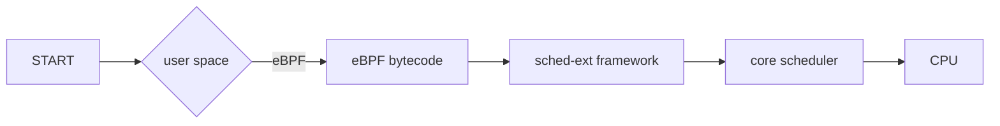

# External Scheduler

Linux kernel 6.12 introduced `sched_ext` (extensible scheduler) as a new scheduling class that allows pluggable CPU schedulers via eBPF.

Enables implementing and dynamically loading thread schedulers. No need for recompiling the kernel and rebooting.

[sched-ext/scx](https://github.com/sched-ext/scx/) project is a collection of `sched_ext` schedulers and tools. Schedulers in scx range from simple demonstrative policies to production-oriented ones tailored for specific use cases:
* scx_simple : basic FIFO or least-run-time policy
* scx_nest : places tasks on high-frequency cores
* scx_lavd : is optimized for gaming workloads
* scx_rusty : partitions CPUs by last-level cache to improve locality
* scx_bpfland : threads that block frequently (i.e. perform many voluntary context switches per second) are assumed to be interactive, and thus prioritized

> [!TIP] Each scheduler in SCX implements required `sched_ext` hooks
> Via eBPF programs and can be selected at runtime. The default Linux scheduler can always be restored if needed.

## eBPF

High-level architecture:

## Architecture

1. Task Wakeup
- A task becomes runnable. Exp: you press a key, a timer fires, blocked thread gets unblocked
- Now Linux must decide: where should this task run?

2. `ops.select_cpu()`
- Your BPF scheduler is asked: Which CPU should this task run on?
- You return a CPU number.

3. Direct dispatch?
- Now kernel asks: Should we run it immediately on that CPU?
- If YES: kernel calls `scx_bpf_dispatch()`
- This directly hands the task to that CPU.
- No queue. No waiting.
- If NO: we go to `ops.enqueue`
- It means put the task into some queue

4. Enqueue Options (Where Can Task Go?)
- Three options
- Built-in CPU Local DSQ
- Built-in Global DSQ
- You define your own queue
- This is where `sched_ext` becomes powerful.
- You can build: CFS-like, RT-like, or completely weird experimental scheduler

5. CPU Becomes Ready
- First check: Does the CPU have tasks in its local queue?
- If YES: run from there
- If NO: check global DSQ and run from there
- If NO: go to custom dispatch logic

6. ops.dispatch()
- If no built-in queues worked, kernel calls your: ops.dispatch()
- Now you decide: Which task should this CPU run?
- You have these options
- Call: `scx_bpf_dispatch()`, push a task to the cpu
- Call: `scx_bpf_consume()`, pull from some DSQ
- Then loops again: Local DSQ? Run task.

## Why This Design?

Because SCX separates:

Enqueue phase: When task becomes runnable
Dispatch phase: When CPU needs work

This is powerful because:

- You can control placement (select_cpu)
- You can control queuing
- You can control dispatch
- You can build any scheduling algorithm

## Hooks

Instead of CFS picking tasks via `pick_next_task_fair()`, sched-ext allows:
`pick_next_task_ext()` to be delegated to BPF.

sched-ext exposes the following hooks:
- enqueue
- dequeue
- `pick_next_task`
- dispatch
- `task_tick`
- `task_exit`

